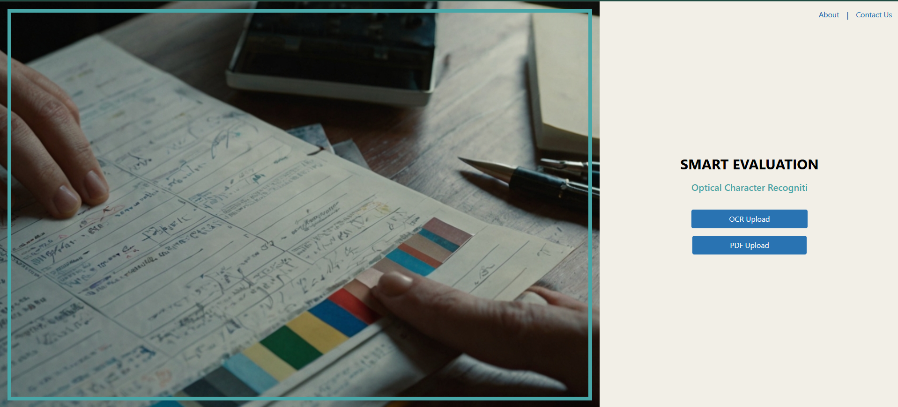
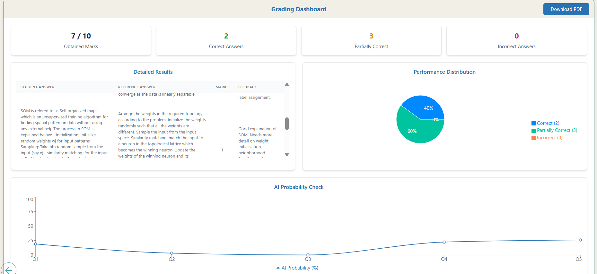
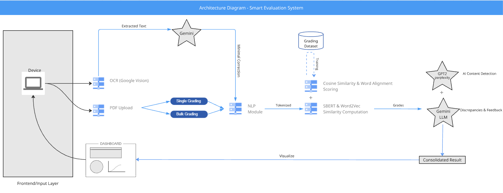

# 📚 Smart Evaluation System

 An AI-powered tool for automatically grading student answer sheets by comparing them with the reference question paper. 
 It supports both handwritten (OCR) and typed answer sheets using advanced NLP, AI, and ML techniques.

 ## 🚀 Features

 - ✅ Upload **Question PDF** (typed)
 - ✅ Upload **Answer PDF** (typed or handwritten)
 - ✅ Supports **OCR** for handwriting using Google Vision API
 - ✅ Uses **SBERT** and **Word2Vec** for semantic & keyword similarity
 - ✅ Calculates **cosine similarity**, **word alignment score**, and **demoted score**
 - ✅ Detects **AI-generated answers** using **GPT-2 Perplexity**
 - ✅ Grades answers based on multiple metrics
 - ✅ Frontend built with React
 - ✅ Backend built with Flask
 - ✅ Deployable on platforms like Hugging Face Spaces or Azure

 ---

 ## 🧠 Technologies Used

 - **Frontend**: React.js, TailwindCSS
 - **Backend**: Flask, Python
 - **OCR**: Google Vision API
 - **LLMs**: Gemini (for text refinement)
 - **Embeddings**: 
   - [SBERT](https://www.sbert.net/) (768-d)
   - [Word2Vec (GoogleNews-vectors)](https://code.google.com/archive/p/word2vec/) (300-d)
 - **Similarity Metrics**:
   - Cosine Similarity
   - Word Alignment Score
   - Demoted Cosine Score
 - **AI Detection**:
   - GPT-2 Perplexity scoring

 ---

 ## 🗂️ Project Structure

 ```
 Smart-Evaluation-System/
 ├── Backend/
 │   ├── app.py              # Main Flask API
 │   ├── utils.py            # PII masking, demotion, similarity metrics
 │   ├── models/             # Embedding and classification models
 │   └── data/               # Sample CSVs for grading results
 │
 ├── Frontend/
 │   ├── public/
 │   ├── src/
 │   │   ├── components/
 │   │   ├── pages/
 │   │   └── PdfUpload.js    # Upload and view grading results
 │
 ├── question_pdfs/          # Upload your reference questions here
 ├── answer_pdfs/            # Upload student answers here
 └── README.md               # 📄 You are here!
 ```

 ---

 ## 🧪 How It Works

 1. **Text Extraction**  
    - For typed PDFs → PyMuPDF  
    - For handwritten PDFs → Converted to images, passed to Google Vision OCR  
    - Extracted text refined using Gemini

 2. **Question Segmentation**  
    - Text is split using regex on patterns like `Q1.`, `Q2.`, etc.

 3. **Embedding Generation**
    - SBERT → Semantic vector (768-d)
    - Word2Vec → Keyword vector (300-d)

 4. **Similarity Calculation**
    - Cosine Similarity (SBERT & Word2Vec)
    - Word Alignment Score
    - Demoted Similarity (student answer with question words removed)

 5. **AI Text Detection**
    - GPT-2 Perplexity scoring
    - Converts to probability of AI-generated content

 6. **Grading Logic**
    - Combined Score = `0.6 * SBERT + 0.4 * Word2Vec`
    - Threshold-based grading:
        - ≥ 0.81 → Fully Correct (Grade 2)
        - 0.27–0.69 → Partially Correct (Grade 1)
        - ≤ 0.27 → Incorrect (Grade 0)
    - Edge cases may be refined using Gemini

 ---

 ## 📊 Outputs

 - `grades_auto`: Auto-generated grade (0, 1, 2)
 - `cos_similarity`: Semantic similarity
 - `aligned_score`: Keyword-level overlap
 - `perplexity_score`: AI-generation probability
 - Graphs and KPI charts on frontend

 ---

 ## ⚙️ Setup Instructions

 ### 🔹 Backend
 ```bash
 cd Backend
 pip install -r requirements.txt
 python app.py
 ```

 ### 🔹 Frontend
 ```bash
 cd Frontend
 npm install
 npm start
 ```

 ---

 ## 📦 Sample Data

 Use folders:
 - `question_pdfs/` → Place sample question PDFs here
 - `answer_pdfs/` → Place sample answer sheets here

 Backend will automatically process them on upload.

 ---

 ## 🧑‍🎓 Academic Relevance

 This project integrates:
 - Artificial Intelligence (AI)
 - Machine Learning (ML)
 - Natural Language Processing (NLP)
 - OCR (Optical Character Recognition)

 It aligns with **UN SDG Goal 4: Quality Education**, supporting scalable, unbiased, and automated student assessment.

 ---

 ## 🖼️ Sample Screenshots

 ### 📌 Home Page
 

 ### 📌 Grading Results
 

  ### 📌 Architecture Diagram
 


